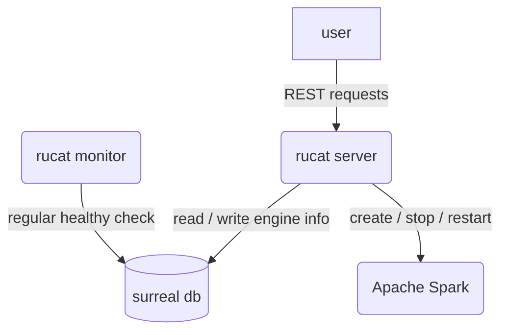
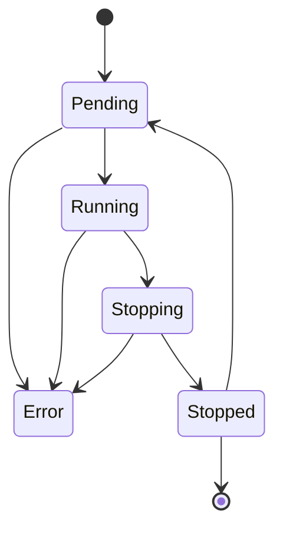

# Rucat

Unified gateway to create, connect and manage data engine on Kubernetes.

Rucat name meaning is Guider, Discipline, Adventurer and Rucat is a Boy / Girl name. The Numerology Number for the name Rucat is 9.



## Rucat Engine State



## How to test

```bash
bash test.sh
```

## How to run

```bash
bash ./example/run.sh
```

## TODO

1. test graceful shutdown
2. create Spark with configs
3. redesign engine state: depends on pod state
4. catch the spark driver log before deleting?
5. implement rucat-client (based on spark-connect-rs)
6. deploy surreal on k8s
7. Test graceful shutdown <https://github.com/JosephLenton/axum-test/issues/88#issuecomment-2369720183>
8. Rewrite engine state using Surreal Literal type <https://surrealdb.com/docs/surrealql/datamodel/literals>
9. mock k8s related functions and restore test cases. <https://github.com/asomers/mockall>
10. miri testing <https://github.com/rust-lang/miri>
11. fuzz testing <https://rust-fuzz.github.io/book/introduction.html>

## How to deploy on k8s

1. `helm install rucat rucat`
2. `kubectl port-forward <rucat server pod> 1234:3000`

## How to submit spark

1. `kubectl create clusterrolebinding rucat-role --clusterrole=edit --serviceaccount=default:rucat-server --namespace=default`
2. go into the rucat server pod
3. install java: `apt install openjdk-17-jdk`, `export JAVA_HOME=/usr/lib/jvm/java-17-openjdk-arm64/`
4. download spark 3.5.3 (only the `/sbin` is useful I think ): `wget https://dlcdn.apache.org/spark/spark-3.5.3/spark-3.5.3-bin-hadoop3.tgz`, `tar -xvzf spark-3.5.3-bin-hadoop3.tgz`

## Debug

Dummy command that can make a pod running forever: `tail -f /dev/null`
