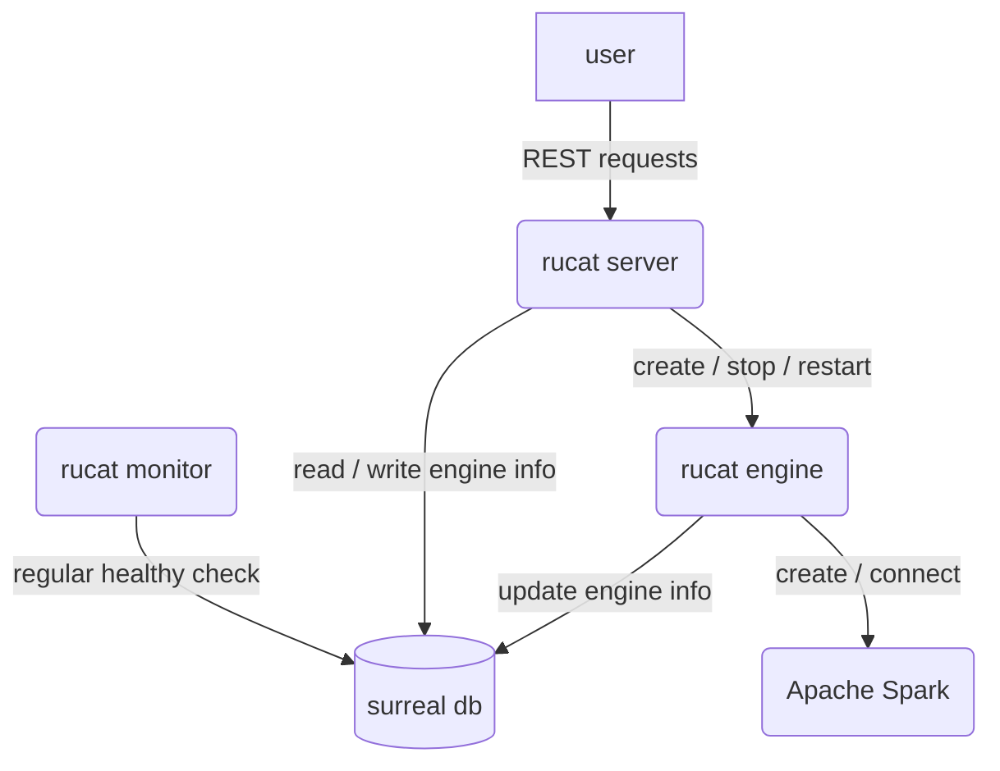
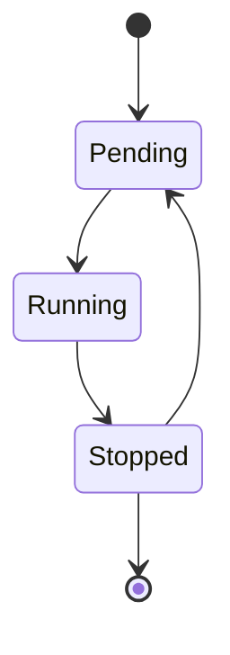

# Rucat

Unified gateway to create, connect and manage data engine on any platform.

Rucat name meaning is Guider, Discipline, Adventurer and Rucat is a Boy / Girl name. The Numerology Number for the name Rucat is 9.



## Rucat Engine State



## How to test

```bash
bash test.sh
```

## How to run

```bash
bash ./example/run.sh
```

## TODO

1. Add heartbeat for rucat engine -> rucat engine update the discovery time in database regularly.
2. Implement rucat monitor to check the database regularly and detect unhealthy engines
3. server sends requests to engine by RPC.
4. implement spark submit. (standalone, local mode for now, k8s mode in the future)
5. test graceful shutdown
6. Add connect engine function to connect to the engine. (by spark-connect-rs for instance)
7. 3 mode for rucat server:
  embedded mode: use in memory db, can only create engine in the same process (embedded)
  local mode: use local mode db, can create engines embedded or locally
  remote mode: use remote db, can create engines embedded, locally or remotely.
8. deploy surreal on k8s
9. investigate how spark-connect-rs is used
10. Test graceful shutdown <https://github.com/JosephLenton/axum-test/issues/88#issuecomment-2369720183>
11. Rewrite engine state using Surreal Literal type <https://surrealdb.com/docs/surrealql/datamodel/literals>
12. Consider if rucat_engine can be removed. Use <https://github.com/kube-rs/kube> to detect the pod status of Spark.

## How to deploy on k8s

1. `helm install rucat rucat`
2. `kubectl port-forward <rucat server pod> 1234:3000`
