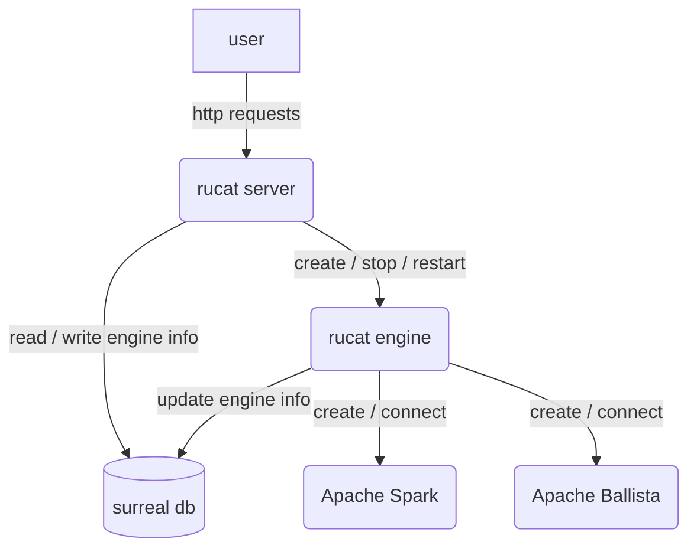
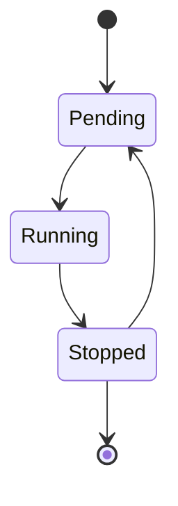

# Rucat

Unified gateway to create, connect and manage data engine on any platform.

Rucat name meaning is Guider, Discipline, Adventurer and Rucat is a Boy / Girl name. The Numerology Number for the name Rucat is 9.

## Rucat Engine State

## TODO

Add heartbeat for rucat engine
running state with endpoint
mock rucat engine for testing / embedded rucat engine ?
rucat engine update engine state in database? Is it really needed?
Add connect engine function to connect to the engine that is not created by rucat. (by spark-connect-rs for instance)
3 mode for rucat server:
  embedded mode: use in memory db, can only create engine in the same process (embedded)
  local mode: use local mode db, can create engines embedded or locally
  remote mode: use remote db, can create engines embedded, locally or remotely.
