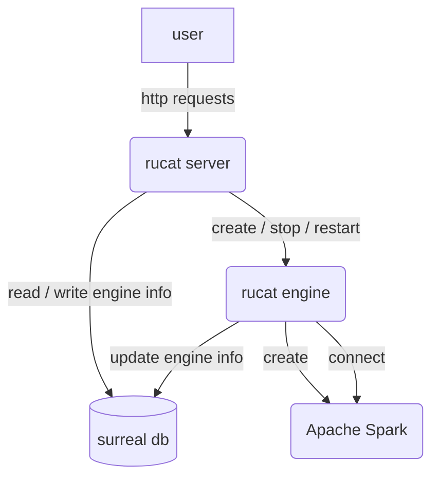
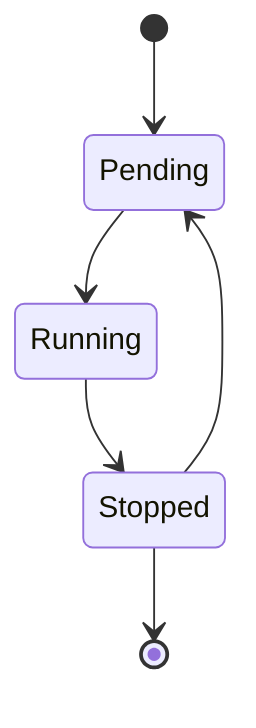

# Rucat

Unified gateway to create, connect and manage data engine on any platform.

Rucat name meaning is Guider, Discipline, Adventurer and Rucat is a Boy / Girl name. The Numerology Number for the name Rucat is 9.

## Rucat Engine State

## TODO

1. Add engine discovery time
2. Add heartbeat for rucat engine -> rucat engine update the discovery time in database regularly, if rucat server finds the time is outdated, it assume the engine has failed and mark the state to be error.
3. server sends requests to engine by RPC.
4. implement spark submit. (standalone, local mode for now, k8s mode in the future)
5. mock rucat engine for testing / embedded rucat engine ?
6. Add connect engine function to connect to the engine that is not created by rucat. (by spark-connect-rs for instance)
7. 3 mode for rucat server:
  embedded mode: use in memory db, can only create engine in the same process (embedded)
  local mode: use local mode db, can create engines embedded or locally
  remote mode: use remote db, can create engines embedded, locally or remotely.
8. Strong typed engineId and engine endpoint
