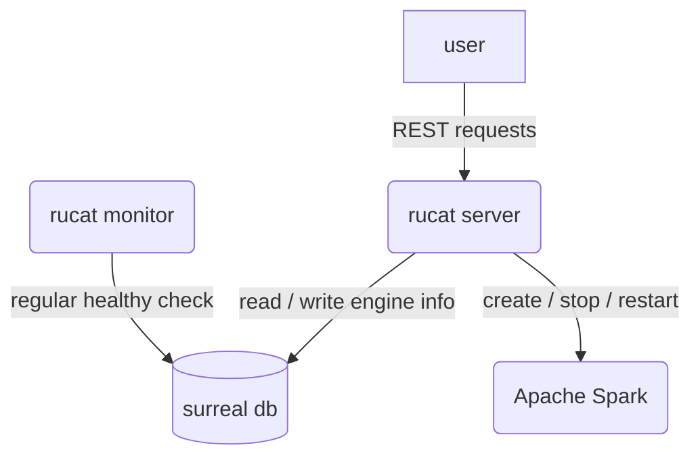
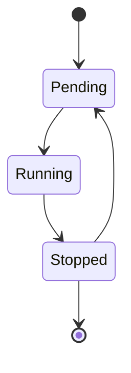

# Rucat

Unified gateway to create, connect and manage data engine on any platform.

Rucat name meaning is Guider, Discipline, Adventurer and Rucat is a Boy / Girl name. The Numerology Number for the name Rucat is 9.



## Rucat Engine State



## How to test

```bash
bash test.sh
```

## How to run

```bash
bash ./example/run.sh
```

## TODO

1. Implement rucat monitor to check the database regularly and detect unhealthy engines
2. test graceful shutdown
3. Add connect engine function to connect to the engine. (by spark-connect-rs for instance)
4. deploy surreal on k8s
5. investigate how spark-connect-rs is used
6. Test graceful shutdown <https://github.com/JosephLenton/axum-test/issues/88#issuecomment-2369720183>
7. Rewrite engine state using Surreal Literal type <https://surrealdb.com/docs/surrealql/datamodel/literals>
8. Consider if rucat_engine can be removed. Use <https://github.com/kube-rs/kube> to detect the pod status of Spark.

## How to deploy on k8s

1. `helm install rucat rucat`
2. `kubectl port-forward <rucat server pod> 1234:3000`

## How to submit spark

1. `kubectl create clusterrolebinding rucat-role --clusterrole=edit --serviceaccount=default:rucat-server --namespace=default`
2. go into the rucat server pod
3. install java: `apt install openjdk-17-jdk`, `export JAVA_HOME=/usr/lib/jvm/java-17-openjdk-arm64/`
4. download spark 3.5.3 (only the `/sbin` is useful I think ): `wget https://dlcdn.apache.org/spark/spark-3.5.3/spark-3.5.3-bin-hadoop3.tgz`, `tar -xvzf spark-3.5.3-bin-hadoop3.tgz`
5. run spark submit with spark 3.5.3: `bash ./start-connect-server.sh --master k8s://https://kubernetes:443 --deploy-mode client --conf spark.kubernetes.container.image=apache/spark:3.5.3 --packages org.apache.spark:spark-connect_2.12:3.5.3 --conf spark.driver.extraJavaOptions="-Divy.cache.dir=/tmp -Divy.home=/tmp"`
6. spark connect only support client mode for now, we need a wrapper docker for spark to execute spark-submit: <https://www.reddit.com/r/apachespark/comments/14bp1ub/comment/joz1fld/?utm_source=share&utm_medium=web3x&utm_name=web3xcss&utm_term=1&utm_content=share_button>

## Debug

Dummy command that can make a pod running forever: `tail -f /dev/null`
