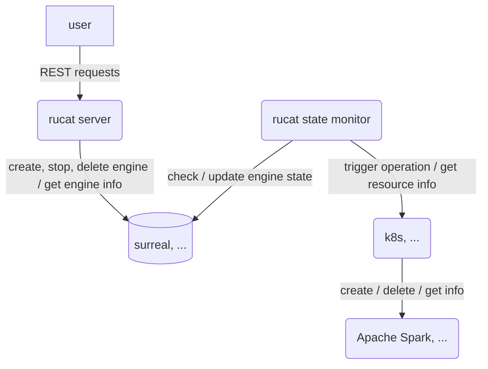

# Rucat

Rucat is design to be a server for managing multiple kinds of big-data applications across different platforms.
For now, it only supports Apache Spark 3.5.3 (with spark-connect enabled by default) on Kubernetes. More engines and platforms will be supported in the future.

Rucat is a Boy / Girl name, meaning is Guider, Discipline and Adventurer. The Numerology Number for the name Rucat is 9.

**Note**: This project is still in the early stage of development. It is not recommended to use it in production.

## Architecture

### Idea

1. fully async
2. decouple rest server and k8s, apache spark



## Rucat Engine State


## How to test

```bash
cargo test
```

## Configurations

### rucat server configurations

- command line arguments:

```bash
--config-path <path>  # the path of the configuration file
```

- configuration file:

```json
{
    "auth_enable": <bool>,  # enable auth or not when sending request to rucat server. Only supported hard-coded username and password for now.
    "database": { # database configurations. Only support SurrealDB for now.
        "credentials": { # credentials for connecting to the database. Only supported hard-coded username and password for now.
            "username": "admin",
            "password": "admin"
        },
        "uri": "rucat-surrealdb:8000" # URI of the database server.
    }
}
```

### rucat state monitor configurations

- command line arguments: Rucat state monitor does not have any command line arguments for now.
- configuration file:
Path of the configuration file is hard-coded as `/rucat_state_monitor/config.json`.

```json
{
    "check_interval_millis": < non zero u64 >, # the interval of checking the engine state in milliseconds.
    "database": { # same as the database configurations in rucat server.
      "credentials": {
          "username": "admin",
          "password": "admin"
      },
      "uri": "rucat-surrealdb:8000"
    }
}
```

## REST APIs

### Create engine: create a new engine

```http
POST /engine
```

request body:

```json
{
  "name": <non empty string>, # the name of the engine
  "engine_type": <string>, # the type of the engine, only support "Spark" for now.
  "version": <string>, # the version of the engine, only support "3.5.3" for now.
  "configs": { # the configurations of the engine (Spark configurations for now)
    "spark.executor.instances": "1"
  }
}
```

return:

```json
{ "id": <string> engine id}
```

### Get engine: get the engine info

```http
GET /engine/<engine_id>
```

return:

```json
{
  "name": <string> engine name,
  "engine_type": <string> type of engine,
  "version": <string> version of the engine,
  "state": <string> engine state,
  "configs": { # the configurations of the engine
    "spark.executor.instances": "1"
  },
  "create_time": <date> created time of the engine
}
```

### List engines: list all engines

```http
GET /engines
```

return:

```json
[
    {id: <string> engine id},
]
```

### Stop engine: stop the engine

```http
POST /engine/<engine_id>/stop
```

return: None

### Restart engine: Make a stopped engine running again

```http
POST /engine/<engine_id>/restart
```

return: None

### Delete engine: Remove all resources and info of the engine

```http
DELETE /engine/<engine_id>
```

return: None

## How to deploy on k8s and use

- build dockers:

```bash
cd rucat/kubernetes/docker/
bash build rucat_server.sh
bash build rucat_state_monitor.sh
```

- deploy on k8s: `helm install rucat rucat`
- create an Apache Spark using the REST API
- connect to the spark connect server

## TODO

1. catch the spark driver log before deleting?
2. implement rucat-client (based on spark-connect-rs)
3. mock resource client. <https://github.com/asomers/mockall>
4. Handle timeout for `Trigger*` states.
5. rucat server HA
6. multi rucat state monitors
7. More resource clients: Yarn, Spark standalone, Spark local etc.
8. expose spark rpc port and web ui port

## Debug

Dummy command that can make a pod running forever: `tail -f /dev/null`
