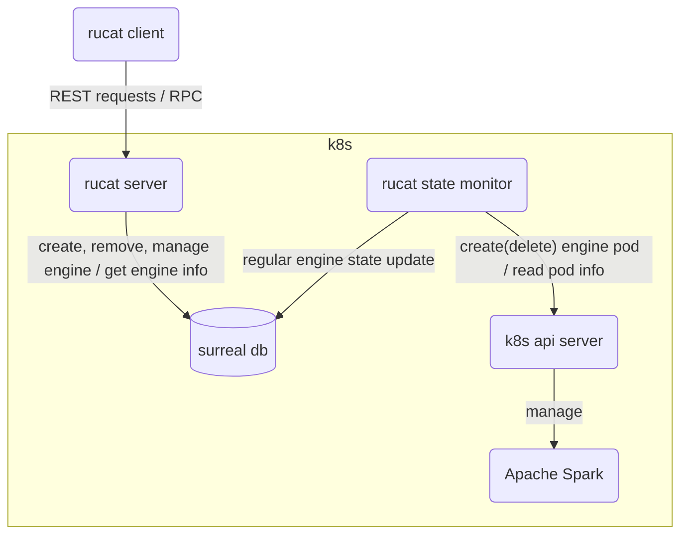
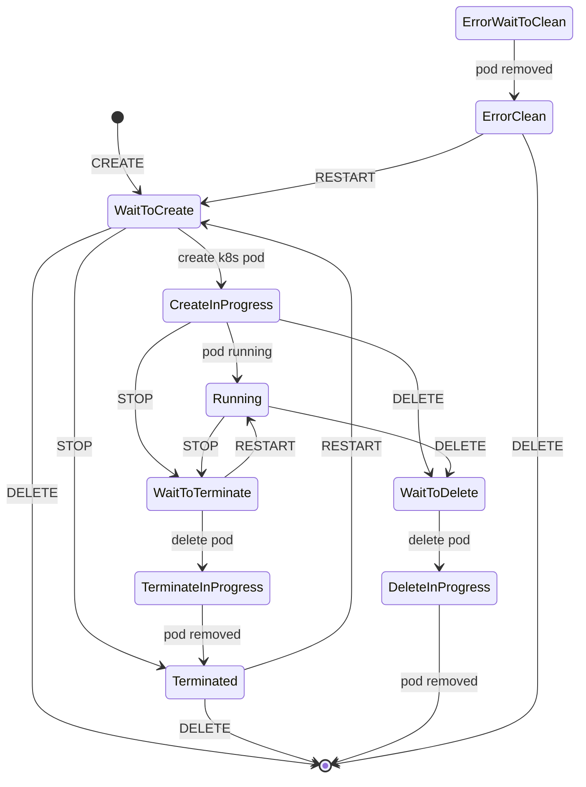

# Rucat

Unified gateway to create, connect and manage data engine on Kubernetes.

Rucat is a Boy / Girl name, meaning is Guider, Discipline and Adventurer. The Numerology Number for the name Rucat is 9.

## Architecture

### Idea

1. fully async
2. decouple rest server and k8s, apache spark



## Rucat Engine State



## How to test

```bash
cargo test
```

## TODO

1. test graceful shutdown
2. catch the spark driver log before deleting?
3. implement rucat-client (based on spark-connect-rs)
4. Rewrite engine state using Surreal Literal type <https://surrealdb.com/docs/surrealql/datamodel/literals>
5. mock all, surrealdb and k8s. <https://github.com/asomers/mockall>
6. miri testing <https://github.com/rust-lang/miri>
7. fuzz testing <https://rust-fuzz.github.io/book/introduction.html>
8. make all request fully async. tasks are submitted by storing info in cluster state, rucat monitor takes account of do the tasks and update the cluster state.
9. Arrow flight sql as protocol

## How to deploy on k8s

1. `helm install rucat rucat`
2. `kubectl port-forward <rucat server pod> 1234:3000`

## Debug

Dummy command that can make a pod running forever: `tail -f /dev/null`
