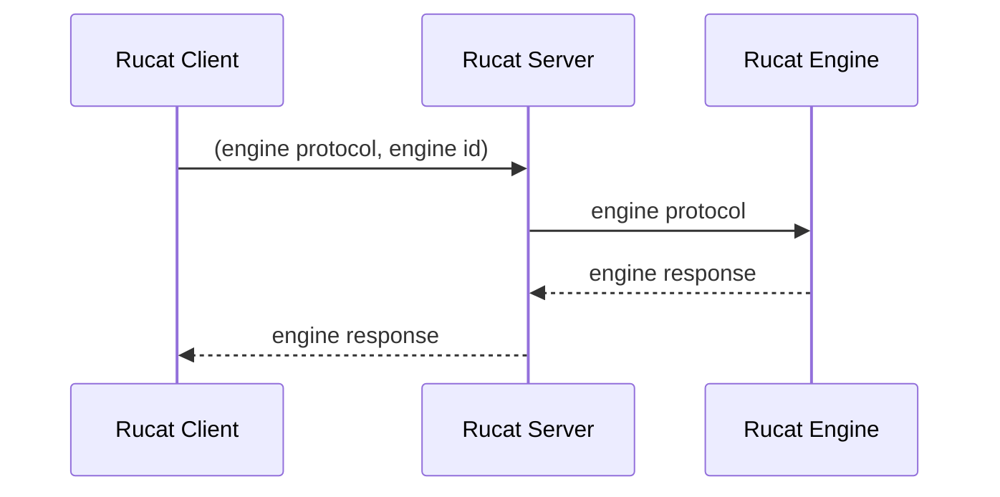

# Rucat

Rucat is design to be a server for managing multiple kinds of big-data applications across different platforms.
For now, it supports Apache Spark 3.5.3 and 3.5.4 (with spark-connect enabled by default) on Kubernetes. More engines and platforms will be supported in the future.

Rucat is a Boy / Girl name, meaning is Guider, Discipline and Adventurer. The Numerology Number for the name Rucat is 9.

**Note**: This project is still in the early stage of development. It is not recommended to use it in production.

## Architecture

### Idea

1. fully async
2. decouple rest server and k8s, apache spark


## Rucat Engine State


## Configurations

### rucat server configurations

- command line arguments:

```bash
--config-path <path>  # the path of the configuration file
```

- configuration file:

```json
{
    "auth_provider": { # this field is optional. If not provided, no authentication is needed. Only support static auth for now.
      "StaticAuthProviderConfig": {
        "username": "admin",
        "password": "admin",
        "bearer_token": "admin"
      }
    },
    "database": { # database configurations. Only support SurrealDB for now.
      "Surreal": {
        "credentials": { # credentials for connecting to the database. Only supported hard-coded username and password for now.
            "username": "admin",
            "password": "admin"
        },
        "uri": "rucat-surrealdb:8000" # URI of the database server.
      }
    }
}
```

### rucat state monitor configurations

- command line arguments: Rucat state monitor does not have any command line arguments for now.
- configuration file:
Path of the configuration file is hard-coded as `/rucat_state_monitor/config.json`.

```json
{
    "check_interval_secs": < u8 >, # the interval of checking the engine state in second.
    "database": { # same as the database configurations in rucat server.
      "Surreal": {
        "credentials": {
            "username": "admin",
            "password": "admin"
        },
        "uri": "rucat-surrealdb:8000"
      }
    }
}
```

## REST APIs

### Create engine: create a new engine

```http
POST /engine
```

request body:

```json
{
  "name": <non empty string>, # the name of the engine
  "engine_type": <string>, # the type of the engine, only support "Spark" for now.
  "version": <string>, # version of the engine.
  "configs": { # the configurations of the engine (Spark configurations for now)
    "spark.executor.instances": "1"
  }
}
```

return:

```json
{ "id": <string> engine id}
```

### Get engine: get the engine info

```http
GET /engine/<engine_id>
```

return:

```json
{
  "name": <string> engine name,
  "engine_type": <string> type of engine,
  "version": <string> version of the engine,
  "state": <string> engine state,
  "configs": { # the configurations of the engine
    "spark.executor.instances": "1"
  },
  "create_time": <date> created time of the engine
}
```

### List engines: list all engines

```http
GET /engines
```

return:

```json
[
    {id: <string> engine id},
]
```

### Stop engine: stop the engine

```http
POST /engine/<engine_id>/stop
```

return: None

### Restart engine: Make a stopped engine running again

```http
POST /engine/<engine_id>/restart
```

return: None

### Delete engine: Remove all resources and info of the engine

```http
DELETE /engine/<engine_id>
```

return: None

## How to deploy on k8s and use

- build dockers:

```bash
cd rucat/kubernetes/docker/
bash build rucat_server.sh
bash build rucat_state_monitor.sh
```

- deploy on k8s: `helm install rucat rucat`
- create an Apache Spark using the REST API
- connect to the spark connect server

## Test

### Unit test

```bash
cargo test
```

### Integration test (not automated)

1. Create a Spark engine, wait it to be running. Get the engine info, stop the engine, restart the engine, delete the engine.
2. Create a Spark engine with wrong configurations, wait it to be in error state. Delete the engine.

## TODO

1. catch the engine log before deleting?
2. multi rucat state monitors
3. More resource clients: Yarn, Spark standalone, Spark local, rust shuttle etc.
4. rucat connection for Spark connect. (RPC or REST for the API? Also see <https://tech.fpcomplete.com/blog/axum-hyper-tonic-tower-part4/> for rpc and rest in one port)
5. Release rucat client crate to cargo.com
6. Officially release docker images to docker hub.
7. Release helm chart.

## Rucat connect design

### Proposal

1. Each engine should already be an RPC server.
2. Rucat client can transparently connect to the engine and support all the operations that the engine supports. It plays as a proxy.
3. Rucat server takes the request from the client and forwards it to the engine.



## Debug

Dummy command that can make a pod run forever: `tail -f /dev/null`
